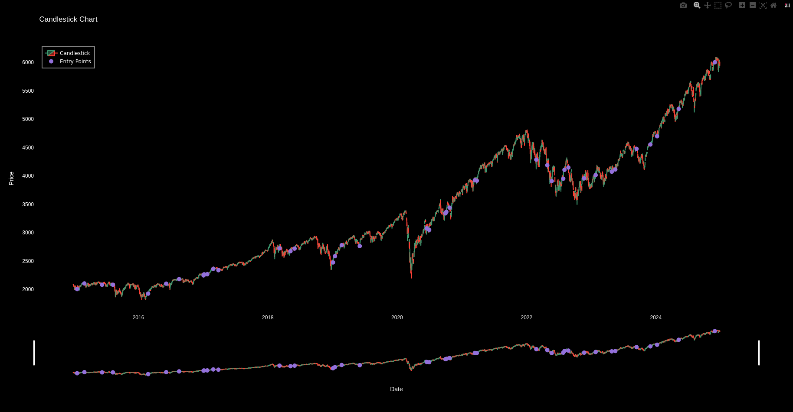

# Final Project: Trading Strategy Backtester

This project is a trading strategy backtester that allows users to test different trading strategies on historical stock data. The application provides a graphical user interface (GUI) for selecting strategies, setting parameters, and visualizing the results.

## Features

- **Strategies**: Includes Moving Average Crossover, Relative Strength Index (RSI), and Michael Harris strategies.
- **Parameter Optimization**: Allows optimization of strategy parameters to maximize returns.
- **Visualization**: Plots candlestick charts with entry and exit points using Plotly.

## Installation

To run this project, you need to have Python installed. Follow the steps below to set up the environment and install the required dependencies.

### Step 1: Clone the Repository

```sh
git clone https://github.com/yourusername/final-project.git
cd final-project
```

### Step 2: Install Dependencies

```sh
pip install -r requirements.txt
```

### Step 3: Run the Application

```sh
python main.py
```

## Usage

1. Select a stock symbol from the dropdown menu.
2. Choose a trading strategy from the list.
3. Set the strategy parameters (e.g., moving average periods, RSI threshold).
4. Click the "Run Backtest" button to test the strategy on historical data.
5. View the results in the candlestick chart and performance metrics table.

## Screenshot

